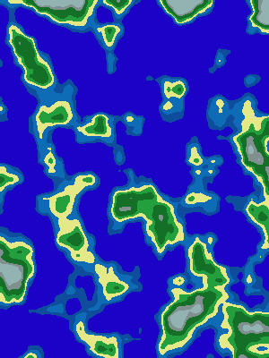

# About

This project is about island map procedural generation using Rust and Web Assembly (yew framework).
The web interface allows to change the generator parameters to customize the map.

The generator is based on Perlin noise.

# How to launch

- Make sure Rust is installed, as well as web assembly tools :
~~~
rustup target add wasm32-unknown-unknown
cargo install trunk
~~~

- Launch the server:
~~~
cd island_map_generator_web_app/
trunk serve --release
~~~

- Open your web brower and go to :
~~~
0.0.0.0:8080
~~~